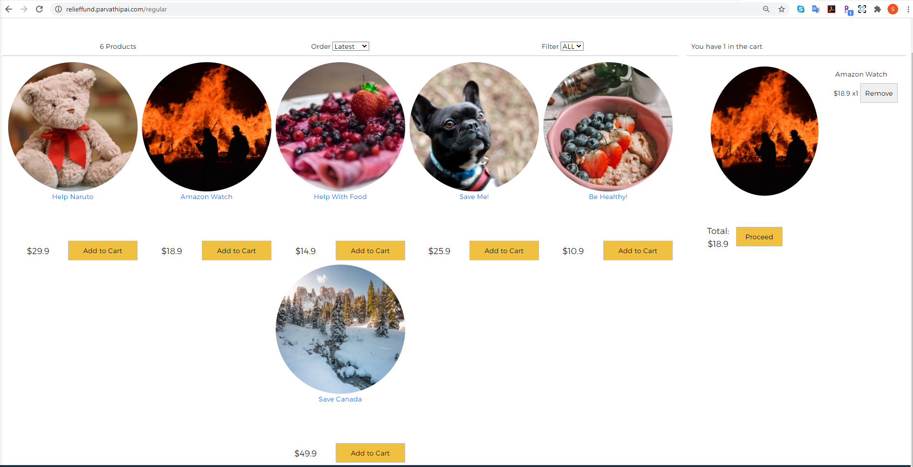

# Enterprise Software Platform Project

## University : [San Jose State University](http://www.sjsu.edu/)
## Course: CMPE 272 - Enterprise Software Platform
## Professor: Andrew Bond
## ISA: Juhi Nayak
## Team :
Student Name      | 
-------------     |
[Parvathi Pai](https://www.linkedin.com/in/parvathipai/)      |
[Shreya Ghotankar](https://www.linkedin.com/in/shreya-ghotankar/)  |
[Sania Gonsalves](https://www.linkedin.com/in/sania-gonsalves-8b961962/)   |

### Introduction
Our team has created a platform for people to contribute to approved charitable institutions. This application denotes an organization which helps impacted people and animal rescue/shelter receive funds for restoration. Different charities can register on our application and get approved to receive donations from application users.
Our application is called Relief Fund and it has three features –
* Spot Donation
* Registered Users can donate to already listed and approved charities
* Charity institutions can join our platform

### Architecture

#### Application UI screenshots
* Video explanation - https://youtu.be/xqQx2U5MEkE
* Link to the website - http://relieffund.parvathipai.com/
  

#### Technology and services Stack
* Okta - Single Page Application
* Payment Gateway - PayPal Sandbox
* AWS resources -
    * AWS RDS -MariaDB
    * AWS S3
    * Amazon CloudFront
    * AWS Lambda
    * Amazon CloudWatch
    * Amazon SNS
* Deployment
    * Docker
    * Docker Compose
    * AWS Elastic Beanstalk

#### Deployment
* Deployed Containers using elastic beanstalk - This makes the backend and front end services  isolated from one other
  
* Conatiner Images in aws EC2
 
* For CI/CD we have made use of AWS codebuild
* 
#### For Front-end setup
##### Install Dependencies
`npm install`

##### Environment variable setup
Create a '.env.local' file in your project root directory.
Add following variables -
* REACT_APP_OKTA_CLIENT_ID={yourClientId}
* REACT_APP_OKTA_ORG_URL=https://{yourOktaDomain}
* REACT_APP_OKTA_API_TOKEN={yourToken}

Use these varaibles in AppWithRouterAccess.js

#### For Back-end setup
* Update application-properties with AWS resources information

#### Security
Added https:

#### Run application
* For Frontend
    `npm start`
    * URI: https://localhost:3000
* For Backend
    * mvn clean package
    * java -jar target/<jar filename> 

